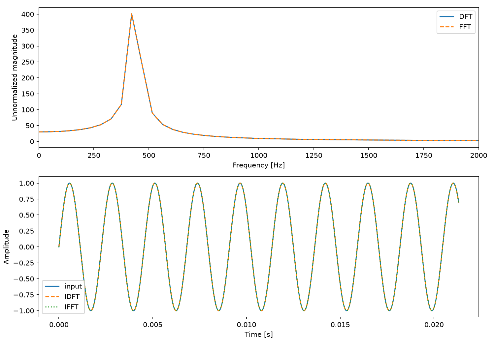

# 離散フーリエ変換と逆変換の実装

## 1. 目的

離散フーリエ変換（DFT）と逆変換（IDFT）をCで実装し、時間波形から周波数成分を求めた。逆変換で波形が復元できるかを確認し、標本数を変えたときの処理時間を比較した。

## 2. 実装方法

\[
X[k]=\sum_{n=0}^{N-1}x[n]e^{-j2\pi kn/N},\qquad
x[n]=\frac1N\sum_{k=0}^{N-1}X[k]e^{j2\pi kn/N}
\]

`dft.c` はこの式を二重ループで計算する。順変換の指数は負、逆変換は正で、`1/N` は逆変換側だけに掛ける。複素数にはC99の `double complex` を用いた。

WAVの第1チャネルから指定区間をコピーし、波形・振幅スペクトル・逆変換波形をテキスト出力する。時間刻みは `dt=1/fs`、周波数刻みは `df=fs/N` である。標本数は1〜1,048,576、開始位置は0以上とし、入力範囲を超える区間を拒否する。ただし、この上限までのDFTを短時間で計算できるという意味ではない。

波形とスペクトルの領域はヒープに確保し、使用後に解放する。数値出力は有効数字17桁とし、検証時にテキスト化の丸め誤差が支配的にならないようにした。

## 3. 実験条件と結果

入力は48 kHz・16 bit・モノラルの440 Hz正弦波。分析区間は先頭1,024標本である。

| 項目 | 値 |
|---|---:|
| 分析標本数 | 1,024 |
| 区間長 | 21.333 ms |
| 周波数刻み | 46.875 Hz |
| 正の周波数側の最大ビン | k=9、421.875 Hz |
| IDFTと入力の最大絶対差 | $3.765 \times 10^{-13}$ |



上段はDFTとFFTの振幅スペクトル、下段は入力と逆変換波形である。振幅スペクトルはDFTの未正規化の絶対値を表示している。ここでは窓関数を追加せず、指定区間をそのまま用いた。

440 Hzは周波数ビンに一致しないため、近傍の複数ビンへ成分が広がった。最大ビンが421.875 Hzになるのは、信号がその周波数に変化したという意味ではなく、有限区間の切り出しと離散的な周波数目盛りによるものである。

逆変換の最大誤差は約 $10^{-13}$ で、今回の入力について、浮動小数点演算の丸め誤差の範囲で波形を復元できた。

## 4. 計算量と処理時間

時間測定には `CLOCK_MONOTONIC` を使用した。比較用の `ft.c` 内でDFT・IDFTをそれぞれ5回実行し、関数呼び出し前後の差から中央値を求めた。ファイル入出力・画像生成は測定区間に含めない。`dft.c` と比較用DFTは同じ定義式を計算するが、時間表は比較プログラム内の関数の測定値である。

| N | DFT中央値 [ms] | IDFT中央値 [ms] |
|---:|---:|---:|
| 64 | 0.083712 | 0.074755 |
| 256 | 1.064679 | 1.210481 |
| 1,024 | 17.685180 | 17.034300 |
| 4,096 | 264.932400 | 268.945100 |

Nを1,024から4,096へ4倍にすると、DFT時間は約15.0倍となった。二重ループの計算量 `O(N²)` による16倍という予想とおおむね整合する。小さいNではタイマーや実行状態の影響が相対的に大きいため、すべての点が理論比率に一致するわけではない。

## 5. 工夫点と考察

- 複素数型を用いると定義式に近い記述ができ、符号や逆変換の係数を確認しやすい。ただし、型を使ったこと自体が高速化の証拠にはならない。
- 内側ループでは局所変数へ和を蓄積し、出力配列への代入は外側ループごとに1回とした。最適化の個別の寄与は分離測定していない。
- 回転子を漸化式で更新すれば指数関数の評価回数を減らせるが、素朴なDFTの二重ループ構造を保つ限り、計算量の次数は `O(N²)` のままである。
- Nを増やすと `fs/N` が小さくなる一方、処理時間と必要な観測時間が増える。周波数刻みの細かさだけでなく、時間変化を追跡できるかも考える必要がある。
- Hann窓などは側ローブを抑えてスペクトル漏れを軽減するが、矩形窓より主ローブを広げる。窓を掛ければ無条件に近接した周波数の分離能力が上がるわけではない。

DFTの定義式は短いコードで表現できるが、標本数の増加に対する計算量は大きい。逆変換の正しさを確認するための基準として有用であり、FFTとの比較でもその役割を果たす。

## 6. 再現手順・資料

リポジトリのルートで実行する。出力テキストは実行ディレクトリに書き出される。

```sh
make -C reports/pcm
reports/pcm/build/dft reports/assets/pcm/sin_16_1_48000.wav 1024 0
```

- [測定値・実行環境](assets/results.json)、[実行ログ](assets/commands.log)
- [DFTスペクトル](assets/fourier/standalone_dft.txt)、[逆変換波形](assets/fourier/standalone_idft.txt)
- 共通ヘッダ：[pcm.h](pcm/pcm.h)、[cx.h](pcm/cx.h)、[args.h](pcm/args.h)
- 出典：`../slide/Wk5-Spectral Analysis 2.pdf`、19ページ。

## 付録：ソースコード

### pcm/dft.c

```c
// 離散フーリエ変換
// Ver.2023.12.15
// コンパイル：$ cc dft.c -std=c99 -lpcm -lm -o dft
// 実行方法：$ ./dft [入力ファイル.wav [標本数 [始点]]]

#include <stdio.h>
#include <stdlib.h>
#include <time.h>
#include <complex.h>
#include "pcm.h"
#include "cx.h"
#include "args.h"

#define	debug(...)	fprintf(stderr, __VA_ARGS__)
#define	fatal(s, ...)	{ debug(__VA_ARGS__); exit(s); }

// グラフ用データ出力関数
void Plot(const char *file, const Cx *v, int N, double d, double (*func)(Cx v))
{
	FILE	*fp = fopen(file, "w");
	if (!fp) fatal(1, "%s オープン失敗\n", file);

	for (int i = 0; i < N; i++) {
		fprintf(fp, "%.17g\t%.17g\n", i*d, func(v[i]));
	}
	debug("出力ファイル = %s\n", file);
	fclose(fp);
}

// 時間測定関数
double Timer()
{
	struct timespec	ts;		// 時刻データの構造体

	clock_gettime(CLOCK_MONOTONIC, &ts);	// 現在時刻を取得
			// ts.tv_sec：	時刻の整数成分（s；秒）
			// ts.tv_nsec：	時刻の小数成分（ns；ナノ秒）

	return (ts.tv_sec + ts.tv_nsec*1.0e-9);	// 1 ns = 1.0x10^-9 s
}

void DFT(const Cx *x, Cx *X, int N)
{
	for (int k = 0; k < N; k++) {
		Cx s = 0.0;
		for (int n = 0; n < N; n++) {
			s += x[n] * cexp(-J2Pi * (double)k * n / (double)N);
		}
		X[k] = s;
	}
}

void IDFT(const Cx *X, Cx *x, int N)
{
	for (int n = 0; n < N; n++) {
		Cx s = 0.0;
		for (int k = 0; k < N; k++) {
			s += X[k] * cexp(J2Pi * (double)k * n / (double)N);
		}
		x[n] = s / (double)N;
	}
}

int main(int argc, char *argv[])
{
	char	*wav = "-";	// 入力WAVファイル名
	int	N = 480;	// 分析対象区間の標本数
	int	n0 = 0;		// 分析対象区間の始点
	if (argc > 1) wav = argv[1];
	if (argc > 2) N = integer_arg(argv[2], 1, 1048576);
	if (argc > 3) n0 = integer_arg(argv[3], 0, INT_MAX);

	Wav	*p = pcmLoad(wav);
	if (p == NULL) return (1);
	debug("■ 入力データ\n");
	pcmInfo(stderr, p);

	if (N <= 0) {
		debug("エラー：標本数Nは正の整数が必要です（N=%d）\n", N);
		pcmFin(p);
		return (1);
	}
	if (n0 < 0) {
		debug("エラー：始点n0は0以上が必要です（n0=%d）\n", n0);
		pcmFin(p);
		return (1);
	}
	if (p->fmt.fs == 0) {
		debug("エラー：標本化周波数fsが不正です（fs=%u）\n", p->fmt.fs);
		pcmFin(p);
		return (1);
	}
	if ((unsigned long long)n0 + (unsigned long long)N > (unsigned long long)p->len) {
		debug("エラー：分析区間がデータ長を超えています（n0=%d, N=%d, len=%u）\n", n0, N, p->len);
		pcmFin(p);
		return (1);
	}

	debug("■ 分析条件\n");
	debug("開始番号 = %d，\t開始時刻 = %f [s]\n", n0, (double)n0/p->fmt.fs);
	debug("標本数 = %d，\t窓幅 = %f [s]\n", N, (double)N/p->fmt.fs);
	debug("基本周波数 = %f [Hz]\n", p->fmt.fs/(double)N);
	debug("\n");

	Cx *buffer = calloc((size_t)N * 2, sizeof(Cx));
	if (!buffer) { pcmFin(p); fatal(1, "メモリ確保失敗\n"); }
	Cx *x = buffer, *X = x + N;
	double	dt = 1.0/p->fmt.fs;	// Δt = 1/f_s
	double	df = (double)p->fmt.fs/(double)N;	// Δf = f_s/N
	double	*v = &(p->val[0][n0]);		// 分析対象の標本値列の先頭アドレス
	for (int n = 0; n < N; n++) x[n] = v[n];	// 分析対象をバッファへコピー
	pcmFin(p);
	debug("■ 入力波形\n");
	Plot("wf.txt", x, N, dt, creal);
	debug("\n");

	double	t0 = Timer();
	DFT(x, X, N);
	debug("■ DFT\n処理時間 = %f [s]\n", Timer() - t0);
	Plot("dft.txt", X, N, df, cabs);
	debug("\n");

	t0 = Timer();
	IDFT(X, x, N);
	debug("■ IDFT\n処理時間 = %f [s]\n", Timer() - t0);
	Plot("idft.txt", x, N, dt, creal);
	debug("\n");
	free(buffer);
	return (0);
}
```
