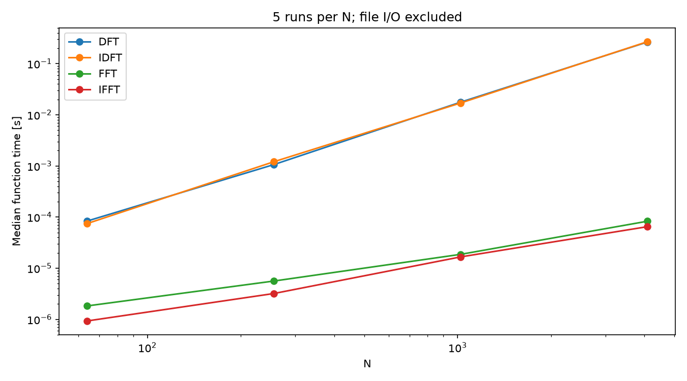

# DFTからFFTへの実装と性能比較

## 1. 目的とプログラム構成

DFTの計算を基数2のFFTへ分解し、周波数成分と逆変換波形が一致するか、また処理時間がどの程度変わるかを調べた。

- `fft.c`：WAVの第1チャネルをFFTし、波形と振幅スペクトルを出力する。課題のFFTソースは本書の付録に掲載した。
- `ft.c`：DFT・IDFT・FFT・IFFTを同じ入力に適用する比較用プログラム。計算時間と複素スペクトル・復元波形の最大誤差を出力する。

`fft.c` の出力はNumPyのFFT、および `dft.c` の出力とも比較した。

## 2. FFTの原理と実装

DFTの和を偶数番目と奇数番目の標本に分け、長さN/2の変換結果をそれぞれ `E[k]`、`O[k]` とすると、

\[
X[k]=E[k]+W_N^kO[k],\qquad
X[k+N/2]=E[k]-W_N^kO[k]
\]

となる。同じ中間結果から2つの出力を求める演算がバタフライ演算である。

実装では、まず入力添字をビット逆順へ並べ替え、その後、長さ2、4、8、…、Nの順にバタフライを繰り返す。全体で `log2 N` 段、各段で `N/2` 個のバタフライが必要なので、計算量は `O(N log N)` となる。

回転子は各段で `cos` と `sin` を各1回計算し、内側では複素乗算で更新する。三角関数の呼び出し回数は、それぞれ `log2 N` 回である。ただし、FFTの計算量改善の本質は、指数関数を減らしたことだけではなく、短いDFTの結果を再利用する分解にある。

FFT本体は配列内で計算し、追加の大きな作業配列を必要としない。比較プログラムでは、入力保存・順逆変換・誤差評価のために複数の配列を使用する。

IFFTでは回転子の符号を正にし、最後にNで割る。比較の基準となる入力は独立した配列に保存し、WAV構造体を解放した後も有効なデータを参照する。

## 3. 実験条件

- 入力：440 Hz、48 kHz、16 bit、モノラルの正弦波。
- 標本数：64、256、1,024、4,096。各条件を別プロセスで5回実行。
- ビルド：GCC 16.1.1、`-O2 -std=c99`。
- 実行環境：Linux x86-64、WSL2。環境の詳細は [results.json](assets/results.json) に収録。
- 時間：`CLOCK_MONOTONIC` による関数呼び出し前後の差。ファイル入出力と画像生成は含めない。

Nは1〜1,048,576の整数を受け付け、2のべき乗でなければ、それを超えない最大の2のべき乗に切り下げる。例えばN=1,500は1,024となる。この処理では分析区間が短くなるため、元の1,500点DFTと同じ結果ではない。

## 4. 結果の一致

N=1,024の結果は次の通りである。

| 比較 | 最大絶対差 |
|---|---:|
| `fft.c` の振幅とNumPy FFTの振幅 | $4.889 \times 10^{-12}$ |
| `dft.c` と `fft.c` の振幅 | $5.139 \times 10^{-11}$ |
| `dft.c` のIDFTと入力 | $3.765 \times 10^{-13}$ |
| 比較プログラムのIFFT実部と入力 | $3.186 \times 10^{-14}$ |


今回の入力では、計算順序に由来する丸め誤差の範囲で結果が一致した。上表の振幅比較だけでは位相まで検証したことにはならないため、比較プログラムでは複素スペクトル全体の差も記録している。[N=1,024の実行ログ](assets/fourier/ft_1024_0.log)を参照。

FFTはDFTを近似する別の変換ではなく、同じDFTを異なる計算順序で求める方法である。ただし、有限精度の計算結果がビット単位で一致するとは限らない。

## 5. 処理時間

下表は5回の中央値。高速化比はDFT中央値をFFT中央値で割った値である。

| N | DFT [ms] | IDFT [ms] | FFT [µs] | IFFT [µs] | DFT/FFT |
|---:|---:|---:|---:|---:|---:|
| 64 | 0.083712 | 0.074755 | 1.833 | 0.932 | 45.7 |
| 256 | 1.064679 | 1.210481 | 5.621 | 3.206 | 189.4 |
| 1,024 | 17.685180 | 17.034300 | 18.696 | 16.663 | 945.9 |
| 4,096 | 264.932400 | 268.945100 | 83.040 | 64.976 | 3,190.4 |



結果表示ページの [スクリーンショット](assets/fourier/screenshot.png) も添付した。

Nが大きくなるほど高速化比が増えた。DFTがN²に比例して計算を増やすのに対し、FFTは段数の増加が緩やかなためである。実測倍率には、DFT内の `cexp` 評価コスト、コンパイラの最適化、キャッシュなども影響する。したがって、表の倍率を別のDFT実装や計算機へそのまま当てはめることはできない。

同じプロセス内で比較してもOSの割込みやCPU周波数変動が消えるわけではない。5回分の個別値と最小・最大値も測定JSONに保存しており、ナノ秒単位の時刻表現をそのまま測定精度とはみなしていない。

## 6. 考察

FFTでは、計算結果を再利用するように式を変形することが大きな効果につながった。コードの小さな最適化だけでなく、計算量そのものを減らすことの重要性が分かる。

一方で、FFTが速くても、音声をまとめて分析するには標本の蓄積時間が必要である。実時間処理の可否はFFTの計算時間だけでなく、フレーム長、入出力バッファ、他の処理の時間まで含めて判断する必要がある。

任意の標本数への対応には、混合基数FFTやBluestein法などの別の構成が必要となる。現在の実装では正の2のべき乗を主な対象とし、範囲外の標本数や開始位置を拒否する。

## 7. 再現手順と資料

```sh
make -C reports/pcm
reports/pcm/build/fft reports/assets/pcm/sin_16_1_48000.wav 1024 0
reports/pcm/build/ft reports/assets/pcm/sin_16_1_48000.wav 1024 0
python3 reports/reproduce.py
```

コマンドはリポジトリのルートで実行する。単独実行時のテキスト出力はカレントディレクトリに保存される。依存ヘッダ：[pcm.h](pcm/pcm.h)、[cx.h](pcm/cx.h)、[args.h](pcm/args.h)。

出典：`../slide/課題_sp0106.jpg`、`../slide/Wk6-EfficientSpectral Analysis 1.pdf`。

## 付録：ソースコード

### pcm/fft.c

```c
// 高速フーリエ変換による周波数特性の算出
// Ver.2026.07.06
// コンパイル：$ cc fft.c -std=c99 -I. -L. -lpcm -lm -o fft
// 実行方法：$ ./fft [入力ファイル.wav [標本数 [始点]]]
//   ※ 標本数 N は 2 のべき乗に切り下げられます
//
// dft.c から，処理時間測定・DFT/IDFT 呼出を削除し，FFT() のみを呼び出す版．
// 入力波形を wf.txt，振幅スペクトルを fft.txt に出力する．

#include <stdio.h>
#include <stdlib.h>
#include <complex.h>
#include "pcm.h"
#include "cx.h"
#include "args.h"

#define	debug(...)	fprintf(stderr, __VA_ARGS__)
#define	fatal(s, ...)	{ debug(__VA_ARGS__); exit(s); }

// グラフ用データ出力関数
void Plot(const char *file, const Cx *v, int N, double d, double (*func)(Cx v))
{
	FILE	*fp = fopen(file, "w");
	if (!fp) fatal(1, "%s オープン失敗\n", file);

	for (int i = 0; i < N; i++) {
		fprintf(fp, "%.17g\t%.17g\n", i*d, func(v[i]));
	}
	debug("出力ファイル = %s\n", file);
	fclose(fp);
}

// ビット逆順ソート（in-place）
void BitReverse(Cx *a, int N)
{
	for (int i = 1, j = 0; i < N; i++) {
		int bit = N >> 1;
		for (; j & bit; bit >>= 1) {
			j ^= bit;
		}
		j ^= bit;
		if (i < j) {
			Cx t = a[i];
			a[i] = a[j];
			a[j] = t;
		}
	}
}

// バタフライ演算（sign = -1 で FFT, +1 で IFFT）
void Butterfly(Cx *a, int N, int sign)
{
	for (int len = 2; len <= N; len <<= 1) {
		double	theta = sign * Pi2 / (double)len;
		Cx	wlen = cos(theta) + sin(theta) * I;
		for (int i = 0; i < N; i += len) {
			Cx w = 1.0;
			for (int k = 0; k < len / 2; k++) {
				Cx u = a[i + k];
				Cx t = a[i + k + len/2] * w;
				a[i + k]         = u + t;
				a[i + k + len/2] = u - t;
				w *= wlen;
			}
		}
	}
}

void FFT(Cx *x, int N)
{
	BitReverse(x, N);
	Butterfly(x, N, -1);
}

// N を 2 のべき乗に切り下げ
int FloorPow2(int N)
{
	int p = 1;
	while ((p << 1) <= N) p <<= 1;
	return p;
}

int main(int argc, char *argv[])
{
	char	*wav = "-";
	int	N0 = 8192;
	int	n0 = 0;
	if (argc > 1) wav = argv[1];
	if (argc > 2) N0 = integer_arg(argv[2], 1, 1048576);
	if (argc > 3) n0 = integer_arg(argv[3], 0, INT_MAX);

	Wav	*p = pcmLoad(wav);
	if (p == NULL) return (1);
	debug("■ 入力データ\n");
	pcmInfo(stderr, p);

	int	N = FloorPow2(N0);
	if (N != N0)
		debug("注：N=%d は 2 のべき乗でないため %d に切り下げます\n", N0, N);

	if (N <= 0) {
		debug("エラー：標本数Nは正の整数が必要です（N=%d）\n", N);
		pcmFin(p);
		return (1);
	}
	if (n0 < 0) {
		debug("エラー：始点n0は0以上が必要です（n0=%d）\n", n0);
		pcmFin(p);
		return (1);
	}
	if (p->fmt.fs == 0) {
		debug("エラー：標本化周波数fsが不正です（fs=%u）\n", p->fmt.fs);
		pcmFin(p);
		return (1);
	}
	if ((unsigned long long)n0 + (unsigned long long)N > (unsigned long long)p->len) {
		debug("エラー：分析区間がデータ長を超えています（n0=%d, N=%d, len=%u）\n",
			n0, N, p->len);
		pcmFin(p);
		return (1);
	}

	debug("■ 分析条件\n");
	debug("開始番号 = %d，\t開始時刻 = %f [s]\n", n0, (double)n0/p->fmt.fs);
	debug("標本数 = %d（2^%d），\t窓幅 = %f [s]\n",
		N, (__builtin_ctz(N)), (double)N/p->fmt.fs);
	debug("基本周波数 = %f [Hz]\n", p->fmt.fs/(double)N);
	debug("\n");

	Cx *x = calloc((size_t)N, sizeof(Cx));
	if (!x) { pcmFin(p); fatal(1, "メモリ確保失敗\n"); }
	double	dt = 1.0/p->fmt.fs;
	double	df = (double)p->fmt.fs/(double)N;
	double	*v = &(p->val[0][n0]);
	for (int n = 0; n < N; n++) x[n] = v[n];
	pcmFin(p);

	debug("■ 入力波形\n");
	Plot("wf.txt", x, N, dt, creal);
	debug("\n");

	FFT(x, N);
	debug("■ FFT 振幅スペクトル（伝達関数の推定）\n");
	Plot("fft.txt", x, N, df, cabs);
	debug("\n");
	free(x);

	return (0);
}
```

### pcm/ft.c

```c
// 高速フーリエ変換（DFT → FFT の発展）
// Ver.2026.06.22
// コンパイル：$ cc ft.c -std=c99 -lpcm -lm -o ft
// 実行方法：$ ./ft [入力ファイル.wav [標本数 [始点]]]
//   ※ 標本数 N は 2 のべき乗に切り下げられます（radix-2 Cooley-Tukey の制約）

#include <stdio.h>
#include <stdlib.h>
#include <time.h>
#include <complex.h>
#include "pcm.h"
#include "cx.h"
#include "args.h"

#define	debug(...)	fprintf(stderr, __VA_ARGS__)
#define	fatal(s, ...)	{ debug(__VA_ARGS__); exit(s); }

// グラフ用データ出力関数
void Plot(const char *file, const Cx *v, int N, double d, double (*func)(Cx v))
{
	FILE	*fp = fopen(file, "w");
	if (!fp) fatal(1, "%s オープン失敗\n", file);

	for (int i = 0; i < N; i++) {
		fprintf(fp, "%.17g\t%.17g\n", i*d, func(v[i]));
	}
	debug("出力ファイル = %s\n", file);
	fclose(fp);
}

// 時間測定関数
double Timer()
{
	struct timespec	ts;		// 時刻データの構造体

	clock_gettime(CLOCK_MONOTONIC, &ts);	// 現在時刻を取得
			// ts.tv_sec：	時刻の整数成分（s；秒）
			// ts.tv_nsec：	時刻の小数成分（ns；ナノ秒）

	return (ts.tv_sec + ts.tv_nsec*1.0e-9);	// 1 ns = 1.0x10^-9 s
}

// === 素朴な DFT / IDFT（計算量 O(N^2)、比較用） ===

void DFT(const Cx *x, Cx *X, int N)
{
	for (int k = 0; k < N; k++) {
		Cx s = 0.0;
		for (int n = 0; n < N; n++) {
			s += x[n] * cexp(-J2Pi * (double)k * n / (double)N);
		}
		X[k] = s;
	}
}

void IDFT(const Cx *X, Cx *x, int N)
{
	for (int n = 0; n < N; n++) {
		Cx s = 0.0;
		for (int k = 0; k < N; k++) {
			s += X[k] * cexp(J2Pi * (double)k * n / (double)N);
		}
		x[n] = s / (double)N;
	}
}

// === FFT / IFFT（radix-2 Cooley-Tukey, in-place, 計算量 O(N log N)） ===

// ビット逆順ソート（in-place）
void BitReverse(Cx *a, int N)
{
	for (int i = 1, j = 0; i < N; i++) {
		int bit = N >> 1;
		for (; j & bit; bit >>= 1) {
			j ^= bit;
		}
		j ^= bit;
		if (i < j) {
			Cx t = a[i];
			a[i] = a[j];
			a[j] = t;
		}
	}
}

// バタフライ演算（共通）
// sign = -1 で FFT, sign = +1 で IFFT
void Butterfly(Cx *a, int N, int sign)
{
	for (int len = 2; len <= N; len <<= 1) {
		double	theta = sign * Pi2 / (double)len;
		Cx	wlen = cos(theta) + sin(theta) * I;	// W_len^1
		for (int i = 0; i < N; i += len) {
			Cx	w = 1.0;
			for (int k = 0; k < len / 2; k++) {
				Cx	u = a[i + k];
				Cx	t = a[i + k + len/2] * w;
				a[i + k]          = u + t;
				a[i + k + len/2]  = u - t;
				w *= wlen;	// 回転子を漸次的に更新（cexp 呼び出しを削減）
			}
		}
	}
}

void FFT(Cx *x, int N)
{
	BitReverse(x, N);
	Butterfly(x, N, -1);
}

void IFFT(Cx *X, int N)
{
	BitReverse(X, N);
	Butterfly(X, N, +1);
	for (int n = 0; n < N; n++) X[n] /= (double)N;
}

// N を 2 のべき乗に切り下げ
int FloorPow2(int N)
{
	int p = 1;
	while ((p << 1) <= N) p <<= 1;
	return p;
}

int main(int argc, char *argv[])
{
	char	*wav = "-";	// 入力WAVファイル名
	int	N0 = 1024;	// 分析対象区間の標本数（指定値）
	int	n0 = 0;		// 分析対象区間の始点
	if (argc > 1) wav = argv[1];
	if (argc > 2) N0 = integer_arg(argv[2], 1, 1048576);
	if (argc > 3) n0 = integer_arg(argv[3], 0, INT_MAX);

	Wav	*p = pcmLoad(wav);
	if (p == NULL) return (1);
	debug("■ 入力データ\n");
	pcmInfo(stderr, p);

	// N を 2 のべき乗に切り下げ（FFT の制約）
	int	N = FloorPow2(N0);
	if (N != N0)
		debug("注：N=%d は 2 のべき乗でないため %d に切り下げます\n", N0, N);

	if (N <= 0) {
		debug("エラー：標本数Nは正の整数が必要です（N=%d）\n", N);
		pcmFin(p);
		return (1);
	}
	if (n0 < 0) {
		debug("エラー：始点n0は0以上が必要です（n0=%d）\n", n0);
		pcmFin(p);
		return (1);
	}
	if (p->fmt.fs == 0) {
		debug("エラー：標本化周波数fsが不正です（fs=%u）\n", p->fmt.fs);
		pcmFin(p);
		return (1);
	}
	if ((unsigned long long)n0 + (unsigned long long)N > (unsigned long long)p->len) {
		debug("エラー：分析区間がデータ長を超えています（n0=%d, N=%d, len=%u）\n", n0, N, p->len);
		pcmFin(p);
		return (1);
	}

	debug("■ 分析条件\n");
	debug("開始番号 = %d，\t開始時刻 = %f [s]\n", n0, (double)n0/p->fmt.fs);
	debug("標本数 = %d（2^%d），\t窓幅 = %f [s]\n",
		N, (__builtin_ctz(N)), (double)N/p->fmt.fs);
	debug("基本周波数 = %f [Hz]\n", p->fmt.fs/(double)N);
	debug("\n");

	Cx *buffer = calloc((size_t)N * 7, sizeof(Cx));
	if (!buffer) { pcmFin(p); fatal(1, "メモリ確保失敗\n"); }
	Cx *xd = buffer, *xf = xd + N, *Xd = xf + N, *Xf = Xd + N;
	Cx *Xf_save = Xf + N, *xd_back = Xf_save + N, *xf_back = xd_back + N;
	double	dt = 1.0/p->fmt.fs;	// Δt = 1/f_s
	double	df = (double)p->fmt.fs/(double)N;	// Δf = f_s/N
	double	*v = &(p->val[0][n0]);		// 分析対象の標本値列の先頭アドレス
	for (int n = 0; n < N; n++) {
		xd[n] = xf[n] = v[n];	// 分析対象を両方のバッファへコピー
	}
	pcmFin(p);
	debug("■ 入力波形\n");
	Plot("wf.txt", xd, N, dt, creal);
	debug("\n");

	// --- DFT + IDFT ---
	double	t0 = Timer();
	DFT(xd, Xd, N);
	double	tDFT = Timer() - t0;
	debug("■ DFT\n処理時間 = %e [s]\n", tDFT);
	Plot("dft.txt", Xd, N, df, cabs);
	debug("\n");

	t0 = Timer();
	IDFT(Xd, xd_back, N);
	double	tIDFT = Timer() - t0;
	debug("■ IDFT\n処理時間 = %e [s]\n", tIDFT);
	Plot("idft.txt", xd_back, N, dt, creal);
	debug("\n");

	// --- FFT + IFFT ---
	t0 = Timer();
	FFT(xf, N);			// in-place で xf にスペクトルが入る
	double	tFFT = Timer() - t0;
	debug("■ FFT\n処理時間 = %e [s]\n", tFFT);
	for (int k = 0; k < N; k++) Xf[k] = xf[k];	// スペクトル退避
	for (int k = 0; k < N; k++) Xf_save[k] = Xf[k];	// 比較用に保存
	Plot("fft.txt", Xf, N, df, cabs);
	debug("\n");

	t0 = Timer();
	IFFT(Xf, N);			// in-place で Xf に時間波形が戻る
	double	tIFFT = Timer() - t0;
	debug("■ IFFT\n処理時間 = %e [s]\n", tIFFT);
	for (int n = 0; n < N; n++) xf_back[n] = Xf[n];
	Plot("ifft.txt", xf_back, N, dt, creal);
	debug("\n");

	// --- 比較サマリ（stderr へ出力） ---
	debug("■ 性能比較（N = %d）\n", N);
	debug("DFT  : %e s\n", tDFT);
	debug("IDFT : %e s\n", tIDFT);
	debug("FFT  : %e s\n", tFFT);
	debug("IFFT : %e s\n", tIFFT);
	if (tFFT > 0.0)
		debug("高速化比 DFT/FFT = %.2f 倍\n", tDFT / tFFT);
	if (tIFFT > 0.0)
		debug("高速化比 IDFT/IFFT = %.2f 倍\n", tIDFT / tIFFT);
	debug("\n");

	// --- 結果の一致検証（DFT と FFT のスペクトル差） ---
	double	maxErr = 0.0;
	for (int k = 0; k < N; k++) {
		double	e = cabs(Xd[k] - Xf_save[k]);
		if (e > maxErr) maxErr = e;
	}
	debug("■ スペクトル一致検証\n");
	debug("max |Xd[k] - Xf[k]| = %e（理論上は丸め誤差程度）\n", maxErr);
	debug("\n");

	// --- 波形復元検証（入力波形と IFFT/IDFT 後の差） ---
	double	maxErrWaveFFT = 0.0, maxErrWaveDFT = 0.0;
	for (int n = 0; n < N; n++) {
		double	eF = cabs(xf_back[n] - xd[n]);
		double	eD = cabs(xd_back[n] - xd[n]);
		if (eF > maxErrWaveFFT) maxErrWaveFFT = eF;
		if (eD > maxErrWaveDFT) maxErrWaveDFT = eD;
	}
	debug("■ 波形復元検証\n");
	debug("max |IFFT(X) - x|    = %e\n", maxErrWaveFFT);
	debug("max |IDFT(Xd) - x|    = %e\n", maxErrWaveDFT);
	debug("\n");
	free(buffer);

	return (0);
}
```
