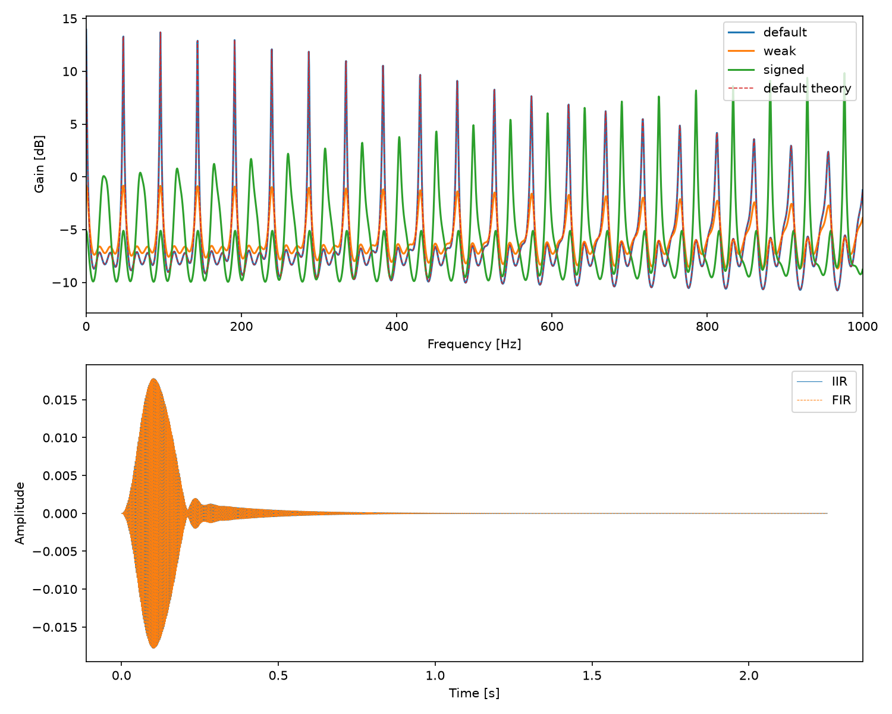
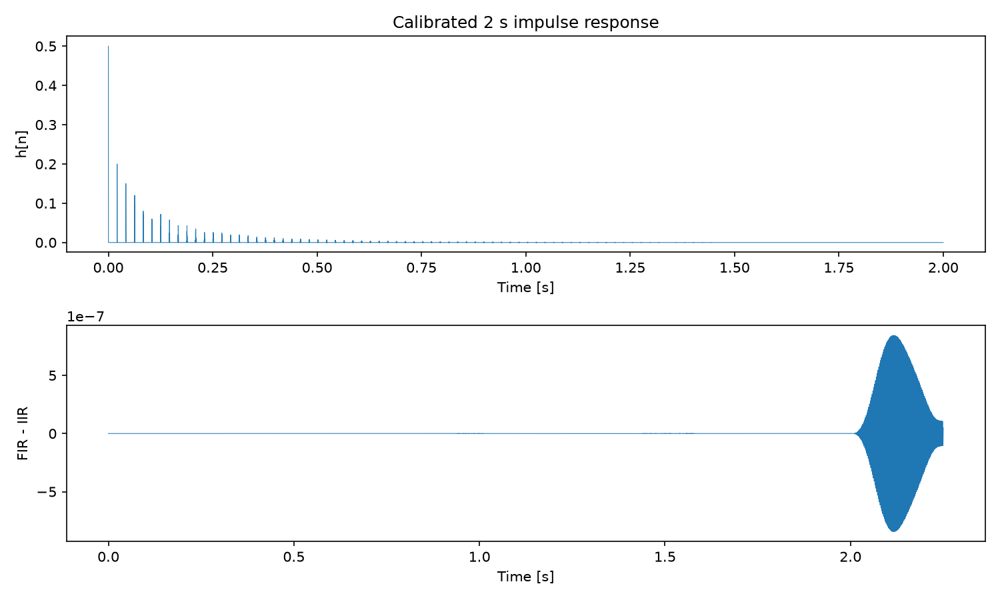

# IIRリバーブとインパルス応答を用いたFIRの比較

## 1. 目的

帰還型のIIRフィルタで残響を生成し、そのインパルス応答をFIRの係数として利用した。両者の波形と周波数特性を比較し、インパルス応答の振幅補正・記録長・量子化が再現性へ与える影響を調べた。

## 2. IIRフィルタの構成

\[
y[n]=0.5x[n]+0.4y[n-1009]+0.3y[n-2011]+0.2y[n-3001]
\]

負の時刻の出力はゼロとする。標本化周波数48 kHzでは、遅延はそれぞれ約21.021、41.896、62.521 msである。3つの帰還項を共通の出力に加える構成であり、独立した3個のコムフィルタの出力を単に足す構成とは異なる。

帰還係数の絶対値和は0.9で、1未満である。帰還演算の利得を絶対値和で抑えられるため、これはBIBO安定性の十分条件となる。個々の係数が1未満であることだけでは、複数帰還経路の安定性は保証できない。

また、安定であっても増幅は起こる。

\[
H(z)=\frac{0.5}{1-0.4z^{-1009}-0.3z^{-2011}-0.2z^{-3001}},\qquad
H(1)=\frac{0.5}{1-0.9}=5
\]

入力ゲイン0.5だけでは音割れを防げない。今回の試験入力は最大振幅0.05とし、絶対値和による出力上界0.25以内に収まる設定にした。

`iir.c` は出力を入力と同じ標本数で保存する。入力が終わった後の応答を得る場合には、必要な長さの無音を入力末尾に付加する。

## 3. インパルス応答の取得

`ip.c` で、先頭だけ振幅0.9、残りがゼロの2秒・32 bit・48 kHz・モノラルWAVを生成した。保存後の先頭標本の値は **0.8999999999068677** である。

```sh
reports/pcm/build/ip 2 32 > /tmp/impulse.wav
reports/pcm/build/iir < /tmp/impulse.wav > /tmp/ir_raw.wav
```

振幅Aのインパルスへの出力は `A h[n]` となるため、そのまま単位インパルス応答としては使えない。実際に保存された入力振幅で出力を割り、32 bit PCMの係数ファイル `ir.wav` として保存した。この校正処理は `reproduce.py` に含めた。

IRは96,000標本で打ち切っている。IIRの真のインパルス応答は無限長なので、このファイルはその有限長近似である。

## 4. FIRの実装

\[
y_{\mathrm{FIR}}[n]=\sum_{m=0}^{M-1}h[m]x[n-m]
\]

出力長は `N+M−1` とし、末尾まで線形畳み込みを出力する。IRは入力と同じ標本化周波数のモノラルに限定し、ステレオ入力には各チャネル独立に同じIRを適用する。

IRの係数和による自動正規化は行わない。正規化するとゲインが変わり、IIRと同じ伝達関数ではなくなるためである。必要なヘッドルームは入力側で確保する。

係数を外側のループ、入力を内側のループで走査することで、内側で `n−m` の範囲検査をする必要がない。値がちょうどゼロの係数は演算を省略するが、小さい非ゼロ係数を閾値で捨てる処理は行っていない。

## 5. 波形の比較

入力は440 Hzの正弦波に滑らかな立ち上がり・立ち下がりを付けた、0.25秒・12,000標本の信号とした。振幅包絡は `sin²(πn/11999)`、最大振幅の設定値は0.05である。

- FIRには0.25秒の入力を与える。
- IIRには同じ入力に無音を付けて107,999標本としたものを与える。
- 比較する両出力の標本化周波数・ビット深度・長さを揃える。

| 項目 | 実測値 |
|---|---:|
| IR長 | 96,000標本、2秒 |
| FIR出力長 | 107,999標本 |
| IIR出力長 | 107,999標本 |
| 両出力の音長 | 約2.249979秒 |
| FIR−IIRの最大絶対差 | $8.438 \times 10^{-7}$ |
| FIR−IIRのRMS誤差 | $1.202 \times 10^{-7}$ |
| IIRの最大絶対振幅 | 0.01780937 |
| FIRの最大絶対振幅 | 0.01780937 |





今回の入力では、波形の最大差は $10^{-6}$ 未満となった。差がゼロでない要因には、IRの2秒での打切り、入力・IR・出力の量子化、浮動小数点演算の丸めがある。有限IRのFIRが無限長IIRと完全に同一だと結論付けることはできない。

## 6. 周波数特性と帰還係数の比較

校正した96,000標本のIRを131,072標本までゼロ詰めしてFFTした。インパルス応答の末尾をさらに切り捨てず、窓関数も掛けていない。窓を掛けるとIRそのものが変わり、測定対象とは異なるフィルタになるためである。振幅は音声スペクトルのように `2/N` 倍せず、IRのFFTをそのまま伝達関数として扱った。

帰還係数の大きさと符号を変えて比較した結果は次の通りである。

| 帰還係数 (a1, a2, a3) | 絶対値和 | 理論DC利得 | 2秒IRの係数和 |
|---|---:|---:|---:|
| (0.40, 0.30, 0.20) | 0.90 | 5.000000 | 4.982669 |
| (0.20, 0.15, 0.10) | 0.45 | 0.909091 | 0.909091 |
| (−0.40, 0.30, 0.20) | 0.90 | 0.555556 | 0.555550 |

正の係数を大きくすると帰還成分が長く残る。標準設定では2秒IRのDC利得が理論値より約0.35%小さく、2秒後にも無視できない係数和が残ることが分かる。

負の係数を含む場合は経路間の打消しが変わり、周波数応答のピーク位置・深さも変化する。絶対値和が等しくても、伝達関数やDC利得は等しくならない。

遅延を単純な整数倍にしないことは応答パターンに影響するが、それだけで聴感上の「濁り」を改善したとは言えない。図から判断できるのは周波数特性の違いである。

## 7. 計算量と考察

IIRは各標本に3つの帰還項を加えるため、計算量は入力長に比例する。今回の実装はファイル全体の配列を使用するが、ストリーミング実装では最大遅延分のリングバッファで帰還状態を保持できる。

直接畳み込みのFIRは `O(NM)` であり、今回の長さではゼロ係数の省略前に約11.52億回の係数・入力の組合せがある。長いIRには、FFTによる高速畳み込みや分割畳み込みが有効である。FIRだから周波数領域で実装できない、ということではない。

今回の比較では、IRを渡すだけでなく、測定インパルスの振幅を補正すること、ゲインを変えないこと、比較する出力長を揃えることが重要だった。音量を正規化した波形同士の見かけの一致より、同じ入力・同じ利得での差を測る方が、フィルタの再現性を確認しやすい。

本実験は波形と数値による比較であり、聴感上の同一性は評価していない。試聴用の [IIR出力](assets/filter/iir.wav) と [FIR出力](assets/filter/fir.wav) を添付する。

## 8. 再現・ソース

```sh
make -C reports/pcm
python3 reports/reproduce.py
```

リポジトリのルートで実行する。[実行ログ](assets/commands.log)、[測定値](assets/results.json)、[校正済みIR](assets/filter/ir.wav) を収録した。IR校正、入力の無音延長、図の作成は [reproduce.py](reproduce.py) で再現できる。

使用ソース：[iir.c](pcm/iir.c)、[fir.c](pcm/fir.c)、[ip.c](pcm/ip.c)、[pcm.c](pcm/pcm.c)。

出典：`../slide/Wk11-DigitalFilter2.pdf`、7〜14ページ。

## 付録：ソースコード

### pcm/iir.c

```c
// IIR 簡易リバーブフィルタ
// Ver.2026.07.06
// コンパイル：$ cc iir.c -std=c99 -I. -L. -lpcm -lm -o iir
// 実行例：$ cat input.wav | ./iir | paplay
// 　　　　$ cat input.wav | ./iir > output.wav
//
// フィルタ構成（並列帰還型）：
//   y[n] = b0 * x[n] + Σ a[m] * y[n - d[m]]
//
// ./iir [a1 a2 a3]：帰還係数の絶対値和を1未満に制限する。
// 出力長は入力と同じ。残響末尾の評価には入力へ無音を追加する。

#include <stdio.h>
#include <stdlib.h>
#include <string.h>
#include <math.h>
#include "pcm.h"

#define	debug(...)      fprintf(stderr, __VA_ARGS__)
#define	fatal(s, ...)   { debug(__VA_ARGS__); exit(s); }

// === フィルタパラメータ ===
// 入力ゲイン：音割れ防止のため 0.5 程度に抑える
static const double	b0 = 0.5;

// 帰還遅延と帰還係数（並列経路）
// 距離 10 [m] 程度の反響を想定すると，fs=48kHz で約 3000 標本となる
// 発散防止のため，帰還係数の絶対値の総和は 1.0 未満にする
static const int	delay[] = { 1009, 2011, 3001 };
static double	alpha[] = { 0.40, 0.30, 0.20 };
static const int	N_DELAY = sizeof(delay) / sizeof(delay[0]);

int main(int argc, char *argv[])
{
	if (argc != 1 && argc != 4) fatal(1, "使い方: iir [a1 a2 a3]\n");
	double sumAbs = 0.0;
	for (int i = 0; i < N_DELAY; i++) {
		if (argc == 4) {
			char *end;
			alpha[i] = strtod(argv[i + 1], &end);
			if (end == argv[i + 1] || *end || !isfinite(alpha[i]))
				fatal(1, "帰還係数が不正です\n");
		}
		sumAbs += fabs(alpha[i]);
	}
	if (sumAbs >= 1.0) fatal(1, "帰還係数の絶対値和は1未満が必要です\n");
	debug("最大振幅の上界倍率 = %.6f\n", b0 / (1.0 - sumAbs));
	Wav	*p = pcmRead(stdin);
	if (p == NULL) fatal(1, "入力WAVの読込失敗\n");

	debug("■ IIR 簡易リバーブフィルタ\n");
	pcmInfo(stderr, p);

	// 最大遅延量の計算
	int	dmax = 0;
	for (int i = 0; i < N_DELAY; i++) {
		if (delay[i] > dmax) dmax = delay[i];
		debug("帰還経路 %d：遅延 = %d 標本，係数 = %f\n",
			i + 1, delay[i], alpha[i]);
	}
	debug("入力ゲイン b0 = %f\n", b0);
	debug("最大遅延量 = %d 標本（約 %.3f [s]）\n",
		dmax, (double)dmax / p->fmt.fs);
	debug("\n");

	// 各チャネルに同じフィルタを適用
	for (int c = 0; c < p->fmt.ch; c++) {
		unsigned int	len = p->len;
		double		*x = p->val[c];

		// 出力バッファ：入出力＋遅延部を確保してゼロ初期化
		// y[n + dmax] が n 番目の出力に対応
		double	*y = (double *)calloc((size_t)len + dmax, sizeof(double));
		if (y == NULL) fatal(1, "出力バッファ確保失敗\n");

		for (unsigned int n = 0; n < len; n++) {
			double	s = b0 * x[n];
			for (int i = 0; i < N_DELAY; i++) {
				s += alpha[i] * y[n + dmax - delay[i]];
			}
			y[n + dmax] = s;
		}

		// 結果を元の配列に書き戻す
		for (unsigned int n = 0; n < len; n++) {
			x[n] = y[n + dmax];
		}

		free(y);
	}

	pcmWrite(stdout, p);
	pcmFin(p);
	return (0);
}
```

### pcm/fir.c

```c
// FIR フィルタ（インパルス応答による畳み込み）
// Ver.2026.07.06
// コンパイル：$ cc fir.c -std=c99 -I. -L. -lpcm -lm -o fir
// 実行例：$ cat input.wav | ./fir ir.wav | paplay
// 　　　　$ cat input.wav | ./fir ir.wav > output.wav
//
// 第 1 引数にインパルス応答ファイル（既定値 "ir.wav"）を指定する．
// 入力信号とインパルス応答を畳み込み，IIR フィルタの特性を再現する．

#include <stdio.h>
#include <stdlib.h>
#include <limits.h>
#include <string.h>
#include <math.h>
#include "pcm.h"

#define	debug(...)	fprintf(stderr, __VA_ARGS__)
#define	fatal(s, ...)	{ debug(__VA_ARGS__); exit(s); }

int main(int argc, char *argv[])
{
	// フィルタ係数（インパルス応答）の入力
	char	*fn = "ir.wav";
	if (argc > 1) fn = argv[1];
	Wav	*ir = pcmLoad(fn);
	if (ir == NULL) fatal(1, "ir: Read失敗\n");

	debug("■ FIR フィルタ\n");
	debug("インパルス応答ファイル = %s\n", fn);
	pcmInfo(stderr, ir);

	double	*b = ir->val[0];
	int	nb = ir->len;

	// 入力信号の読込
	Wav	*p = pcmRead(stdin);
	if (p == NULL) fatal(1, "入力WAVの読込失敗\n");

	if (p->fmt.fs != ir->fmt.fs || ir->fmt.ch != 1) {
		pcmFin(ir);
		pcmFin(p);
		fatal(1, "IRは入力と同じ標本化周波数のモノラルPCMが必要です\n");
	}

	// 入力信号のコピー＆延長
	if (p->len > (unsigned int)INT_MAX - ir->len + 1) {
		pcmFin(ir); pcmFin(p);
		fatal(1, "出力が長すぎます\n");
	}
	int	len0 = p->len;
	int	dn = nb - 1;		// 畳み込みによる延長量
	int	len = len0 + dn;	// 延長後の標本数

	Wav	*out = pcmInit(p->fmt.bit, p->fmt.ch, p->fmt.fs, len);
	if (out == NULL) fatal(1, "出力用WAV確保失敗\n");

	// 係数の利得を保つ。入力振幅はインパルス応答の絶対値和を考慮して設定する。
	double sumAbs = 0.0;
	for (int m = 0; m < nb; m++) sumAbs += fabs(b[m]);
	debug("インパルス応答の絶対値和 = %f\n", sumAbs);

	// 各チャネルに畳み込みを適用
	for (int c = 0; c < p->fmt.ch; c++) {
		double	*x = p->val[c];
		double	*y = out->val[c];

		// y[n] = Σ b[m] * x[n - m]
		for (int m = 0; m < nb; m++) {
			if (b[m] == 0.0) continue;
			for (int n = 0; n < len0; n++) {
				y[n + m] += b[m] * x[n];
			}
		}
	}

	pcmWrite(stdout, out);

	pcmFin(ir);
	pcmFin(p);
	pcmFin(out);
	return (0);
}
```

### pcm/ip.c

```c
// インパルス信号の生成
// Ver.2026.07.06
// コンパイル：$ cc ip.c -std=c99 -I. -L. -lpcm -lm -o ip
// 実行例：$ ./ip > ip.wav
// 　　　　$ ./ip 2.0 32 > ip.wav   # 音長 2.0 秒、32 bit PCM
//
// 先頭 1 標本に振幅 0.9 のインパルスを与え，あとは無音．
// この信号を IIR リバーブフィルタに通すことでインパルス応答を取得する．

#include <stdio.h>
#include <stdlib.h>
#include "pcm.h"
#include "args.h"
#include <math.h>

#define	debug(...)	fprintf(stderr, __VA_ARGS__)
#define	fatal(s, ...)	{ debug(__VA_ARGS__); exit(s); }

int main(int argc, char *argv[])
{
	int	bit = 16;
	int	ch = 1;
	int	fs = 48000;
	double	d = 2.0;		// 既定音長 [s]
	if (argc > 1) {
		char *end;
		d = strtod(argv[1], &end);
		if (end == argv[1] || *end || !isfinite(d) || d <= 0 || d > (double)INT_MAX / fs)
			fatal(1, "音長が不正です\n");
	}
	if (argc > 2) bit = integer_arg(argv[2], 8, 32);

	int	len = (int)(d * fs);
	if (len <= 0) fatal(1, "音長が不正です：%f\n", d);

	Wav	*p = pcmInit(bit, ch, fs, len);
	if (p == NULL) fatal(1, "WAV構造体の生成失敗\n");

	// 先頭 1 標本のみ振幅 0.9，残りは 0
	p->val[0][0] = 0.9;

	debug("■ インパルス生成\n");
	pcmInfo(stderr, p);

	pcmWrite(stdout, p);
	pcmFin(p);
	return (0);
}
```
