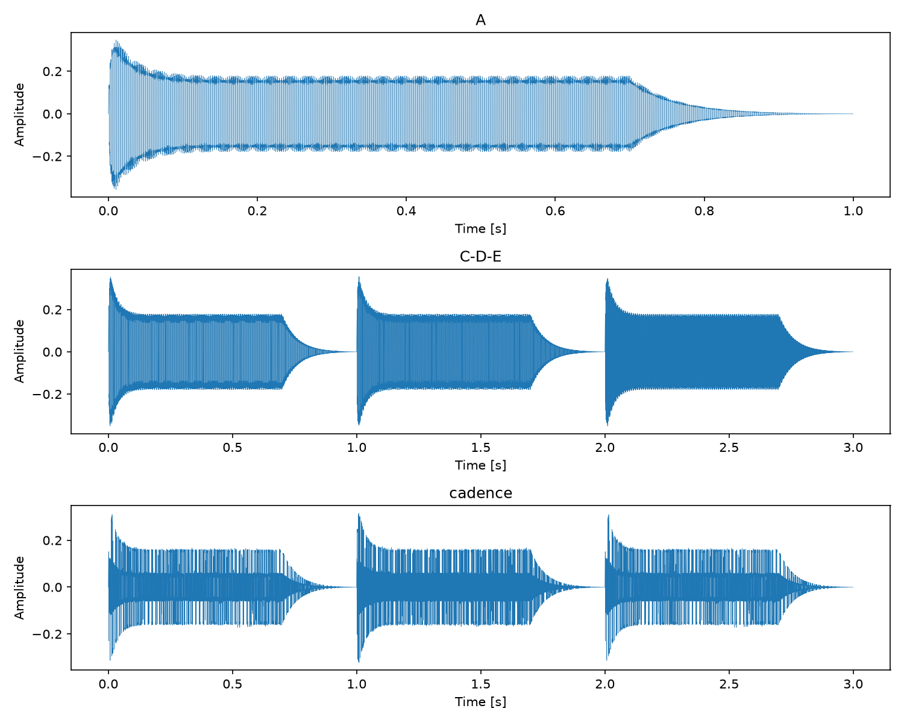
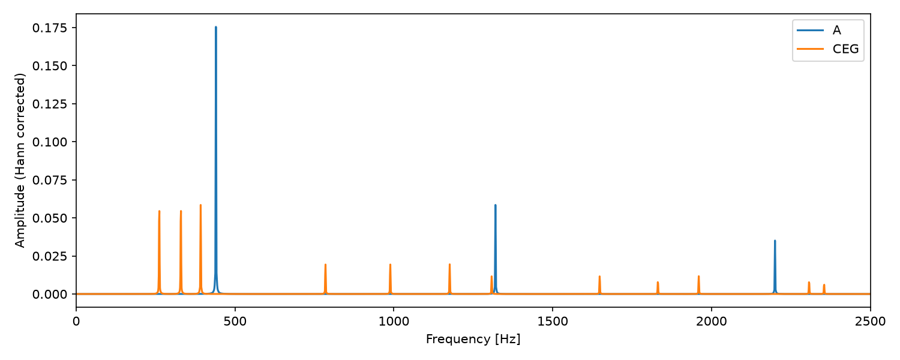

# 加算合成・シーケンサー・ミキサーの実装

## 1. 目的

正弦波の加算と包絡線によって単音を生成し、複数のWAVを連結する `seq.c` と、混合する `mix.c` を実装した。連結によるメロディと、重ね合わせによる和音の違いを、出力標本数と波形から確認した。

## 2. 音源合成

`synth.c` では基本周波数の奇数倍を重ねる。

\[
x(t)=e(t)\sum_{k=1,3,\ldots,K}a_k\sin(2\pi kf_0t),\qquad
 a_k=\frac{1/k}{\sum_{j=1,3,\ldots,K}1/j}
\]

`K` は49以下の奇数で、`Kf0 < fs/2` を満たすものに制限した。高い音でも標本化限界を超える高調波を合成しないためである。係数は正で総和が1なので、加算波形の絶対値は1以下となる。

包絡線はアタック0.01秒、ディケイ0.15秒、サステイン0.5、リリース0.3秒とした。`q = exp(−5)` とおき、立ち上がりを `(1−exp(−5t/A))/(1−q)`、減衰を `S+(1−S)(exp(−5(t−A)/D)−q)/(1−q)` とする。ディケイ終了後は `S` を保ち、リリースでは `S(exp(−5(t−G)/R)−q)/(1−q)` とする。

各区間の境界値が一致するため、接続点の振幅の飛びを抑えられる。終端時刻には最後の標本時刻 `47999/48000` 秒を用い、最後の標本をゼロにした。ファイル全体は48,000標本、1秒である。

## 3. WAVの連結

`seq.c` は、全入力のビット深度・チャネル数・標本化周波数が一致することを確認し、総標本数の出力を確保する。各入力の `val[c]` を `memcpy` で順にコピーする。

\[
N_{\mathrm{out}}=\sum_i N_i
\]

ヘッダ付きWAVをファイル単位でそのまま連結しても、正しい単一WAVにはならない。ヘッダを解釈して標本配列を連結し、出力ヘッダを再構成する必要がある。

## 4. WAVの混合

`mix.c` は最長の入力と同じ標本数を確保し、各時刻の標本を加算して入力数で割る。

\[
y[n]=\frac1M\sum_{i=1}^{M}x_i[n],\qquad
N_{\mathrm{out}}=\max_i N_i
\]

短い入力の範囲外はゼロとして扱う。各入力の絶対値が1以下なら、三角不等式より混合後も1以下となる。`√M` で割る方法は、無相関信号の平均電力を考える際には有用だが、同相で重なる信号のピークを1以下に保証するものではない。

## 5. 実験結果

C4・D4・E4などの単音を生成し、ドレミの連結、C4・E4・G4の和音、C4–E4–G4 → B4–F4–G4 → C4–E4–G4のカデンツを作成した。すべて48 kHz・16 bit・モノラルである。

| 出力 | 標本数 | 音長 [s] |
|---|---:|---:|
| 単音 | 48,000 | 1 |
| C-D-E | 144,000 | 3 |
| CEG和音 | 48,000 | 1 |
| カデンツ | 144,000 | 3 |

CEG和音の最大絶対振幅は **0.313110** であった。入力PCMを実数化して算出した平均値と出力PCMの最大差は $2.035 \times 10^{-5}$ で、16 bit PCMの1 LSB（約 $3.052 \times 10^{-5}$）以内だった。





上の時間波形では、単音が1秒で減衰し、連結結果が3秒になることを確認できる。スペクトルは全標本にHann窓を掛けて算出した。A4は440 Hzとその奇数次高調波を持ち、CEGではC4・E4・G4に対応する複数の系列が重なる。

## 6. 考察

連結は時間方向の配置、混合は同じ時刻の加算である。どちらも実数標本配列の操作で表現できるが、必要な出力長は「合計」と「最大」で異なる。

音色については、高調波の比率だけでなく包絡線も重要である。一定振幅の周期波形と比べて、立ち上がり・持続・減衰を付けた波形では、音の始まりと終わりを明確に表現できる。一方、楽器らしさの評価には試聴が必要であり、この実験の波形一致だけから特定の楽器音を再現したとは判断しない。

## 7. 再現手順

リポジトリのルートで実行する。すべての出力は [assets/generation/](assets/generation/) に収録した。

```sh
make -C reports/pcm
for note in C D E F G A B C5; do
  reports/pcm/build/synth "$note" > "/tmp/$note.wav"
done
reports/pcm/build/seq /tmp/C.wav /tmp/D.wav /tmp/E.wav > /tmp/C-D-E.wav
reports/pcm/build/mix /tmp/C.wav /tmp/E.wav /tmp/G.wav > /tmp/CEG.wav
```

共通の [pcm.c](pcm/pcm.c)、[pcm.h](pcm/pcm.h)、[Makefile](pcm/Makefile) を使用する。課題の根拠は `../slide/Wk3-SignalData-Generation.pdf`、18〜23ページ。

## 付録：ソースコード

### pcm/synth.c

```c
// WAVファイル生成アプリ（加算合成 + ADSR包絡線）
// 改造元ソース：sin.c
// コンパイル：$ cc synth.c -std=c99 -I. -L. -lpcm -lm -o synth
// 実行例：$ ./synth [音名or周波数] | paplay
// 　　　　$ ./synth C > C.wav

#include <stdio.h>
#include <stdlib.h>
#define	_USE_MATH_DEFINES
#define	__USE_XOPEN
#include <math.h>
#include <string.h>
#include "pcm.h"

#define	debug(...)	fprintf(stderr, __VA_ARGS__)
#define	fatal(s, ...)	{ debug(__VA_ARGS__); exit(s); }

// ADSR包絡線 e(t)
// A: アタックタイム [sec]
// D: ディケイタイム [sec]
// S: サステインレベル [0.0, 1.0]
// R: リリースタイム [sec]
// L: デュレーション [sec]
static double envelope(double t, double A, double D, double S, double R, double L)
{
	double G = L - R;
	const double q = exp(-5.0);
	if (t >= L) return 0.0;
	if (t < A) return (1.0 - exp(-5.0 * t / A)) / (1.0 - q);
	if (t < A + D)
		return S + (1.0 - S) * (exp(-5.0 * (t - A) / D) - q) / (1.0 - q);
	if (t < G) return S;
	return S * (exp(-5.0 * (t - G) / R) - q) / (1.0 - q);
}

int main(int argc, char *argv[])
{
	double	f = pcmMusicFreq("A4");	// 既定値：440 Hz
	if (argc > 1) f = pcmMusicFreq(argv[1]);

	int	bit = 16, ch = 1, fs = 48000;
	if (!isfinite(f) || f <= 0 || f >= fs / 2.0) return 1;
	double	L = 1.0;		// デュレーション [sec]
	int	len = (int)(L * fs);	// 総標本数

	// ADSR パラメータ
	double	A = 0.01;	// アタックタイム  [sec]
	double	D = 0.15;	// ディケイタイム  [sec]
	double	S = 0.5;	// サステインレベル [0.0, 1.0]
	double	R = 0.3;	// リリースタイム  [sec]

	// スペクトル分布（矩形波：奇数次高調波のみ，a_k = 4/(π*k)）
	// 鋸歯状波にする場合：a[k] = 2.0 / (M_PI * k) のループを k+=1 で
	// 三角波にする場合：奇数次のみ a[k] = 8.0 / (M_PI*M_PI * k*k)
#define N 50
	double	a[N+1];
	for (int k = 0; k <= N; k++) a[k] = 0.0;
	for (int k = 1; k <= N && k * f < fs / 2.0; k += 2)
		a[k] = 4.0 / (M_PI * k);

	// 振幅スペクトルの正規化（合計が 1.0 になるように）
	double	a0 = 0.0;
	for (int k = 1; k <= N; k++) a0 += a[k];
	for (int k = 1; k <= N; k++) a[k] /= a0;

	Wav	*p = pcmInit(bit, ch, fs, len);
	if (p == NULL) return (1);

	debug("synth: f = %f Hz\n", f);
	pcmInfo(stderr, p);

	double	*x0 = p->val[0];
	for (int i = 0; i < len; i++) {
		double	t  = (double)i / fs;
		double	wt = 2.0 * M_PI * f * t;

		// 加算合成
		double	v = 0.0;
		for (int k = 1; k <= N; k++)
			v += a[k] * sin(k * wt);

		// ADSR 包絡線の適用
		x0[i] = v * envelope(t, A, D, S, R, (double)(len - 1) / fs);
	}

	pcmWrite(stdout, p);
	pcmFin(p);
	return (0);
}
```

### pcm/seq.c

```c
// WAVファイル連結アプリ（シーケンサー）
// コンパイル：$ cc seq.c -std=c99 -I. -L. -lpcm -o seq
// 実行例：$ ./seq C.wav D.wav E.wav > C-D-E.wav
// 　　　　$ ./seq C.wav D.wav E.wav | paplay

#include <stdio.h>
#include <stdlib.h>
#include <limits.h>
#include <string.h>
#include "pcm.h"

#define	debug(...)	fprintf(stderr, __VA_ARGS__)
#define	fatal(s, ...)	{ debug(__VA_ARGS__); exit(s); }

int main(int argc, char *argv[])
{
	if (argc < 2)
		fatal(1, "使い方：%s file1.wav file2.wav ...\n", argv[0]);

	int	n = argc - 1;		// 入力ファイル数

	// 入力 WAV を格納するポインタ配列
	Wav	**in = malloc(n * sizeof(Wav *));
	if (in == NULL) fatal(1, "メモリ確保失敗\n");

	// 全ファイルを読み込み，総標本数を計算
	unsigned int	total_len = 0;
	unsigned int	bit = 16, ch = 1, fs = 48000;

	for (int i = 0; i < n; i++) {
		in[i] = pcmLoad(argv[i + 1]);
		if (in[i] == NULL)
			fatal(1, "読み込み失敗：%s\n", argv[i + 1]);
		if (in[i]->len > UINT_MAX - total_len) {
			for (int j = 0; j <= i; j++) pcmFin(in[j]);
			free(in);
			fatal(1, "出力が長すぎます\n");
		}
		total_len += in[i]->len;
		if (i == 0) {	// 最初のファイルのPCM属性を出力に使う
			bit = in[i]->fmt.bit;
			ch  = in[i]->fmt.ch;
			fs  = in[i]->fmt.fs;
		} else if (bit != in[i]->fmt.bit || ch != in[i]->fmt.ch || fs != in[i]->fmt.fs) {
			for (int j = 0; j <= i; j++) pcmFin(in[j]);
			free(in);
			fatal(1, "入力のPCM属性が一致しません\n");
		}
	}

	// 出力用 WAV を作成（容器：総標本数分）
	Wav	*out = pcmInit(bit, ch, fs, total_len);
	if (out == NULL) fatal(1, "出力用WAV確保失敗\n");

	// 各入力の標本値を出力配列へ順番にコピー
	unsigned int	offset = 0;
	for (int i = 0; i < n; i++) {
		for (int c = 0; c < (int)ch; c++) {
			memcpy(out->val[c] + offset,
			       in[i]->val[c],
			       in[i]->len * sizeof(double));
		}
		offset += in[i]->len;
	}

	pcmWrite(stdout, out);

	for (int i = 0; i < n; i++) pcmFin(in[i]);
	pcmFin(out);
	free(in);
	return (0);
}
```

### pcm/mix.c

```c
// WAVファイル混合アプリ（ミキサー）
// コンパイル：$ cc mix.c -std=c99 -I. -L. -lpcm -o mix
// 実行例：$ ./mix C.wav E.wav G.wav > CEG.wav
// 　　　　$ ./mix C.wav E.wav G.wav | paplay

#include <stdio.h>
#include <stdlib.h>
#include "pcm.h"

#define	debug(...)	fprintf(stderr, __VA_ARGS__)
#define	fatal(s, ...)	{ debug(__VA_ARGS__); exit(s); }

int main(int argc, char *argv[])
{
	if (argc < 2)
		fatal(1, "使い方：%s file1.wav file2.wav ...\n", argv[0]);

	int	n = argc - 1;		// 入力ファイル数

	// 入力 WAV を格納するポインタ配列
	Wav	**in = malloc(n * sizeof(Wav *));
	if (in == NULL) fatal(1, "メモリ確保失敗\n");

	// 全ファイルを読み込み，最大標本数を取得
	unsigned int	max_len = 0;
	unsigned int	bit = 16, ch = 1, fs = 48000;

	for (int i = 0; i < n; i++) {
		in[i] = pcmLoad(argv[i + 1]);
		if (in[i] == NULL)
			fatal(1, "読み込み失敗：%s\n", argv[i + 1]);
		if (in[i]->len > max_len) max_len = in[i]->len;
		if (i == 0) {	// 最初のファイルのPCM属性を出力に使う
			bit = in[i]->fmt.bit;
			ch  = in[i]->fmt.ch;
			fs  = in[i]->fmt.fs;
		} else if (bit != in[i]->fmt.bit || ch != in[i]->fmt.ch || fs != in[i]->fmt.fs) {
			for (int j = 0; j <= i; j++) pcmFin(in[j]);
			free(in);
			fatal(1, "入力のPCM属性が一致しません\n");
		}
	}

	// 出力用 WAV を作成（容器：最大標本数分）
	Wav	*out = pcmInit(bit, ch, fs, max_len);
	if (out == NULL) fatal(1, "出力用WAV確保失敗\n");

	// 各チャネルの瞬時値を混合
	// 音割れ対策：入力数 n で割って振幅を正規化
	for (int c = 0; c < (int)ch; c++) {
		for (unsigned int j = 0; j < max_len; j++) {
			double	v = 0.0;
			for (int i = 0; i < n; i++) {
				if (j < in[i]->len)
					v += in[i]->val[c][j];
			}
			out->val[c][j] = v / n;
		}
	}

	pcmWrite(stdout, out);

	for (int i = 0; i < n; i++) pcmFin(in[i]);
	pcmFin(out);
	free(in);
	return (0);
}
```
