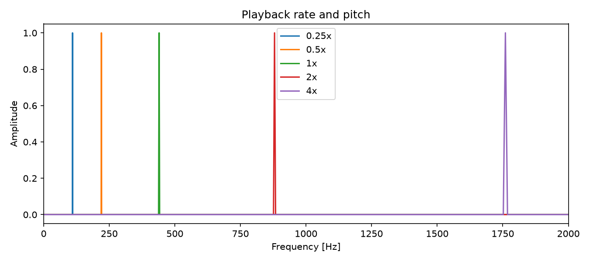

# PCM・WAVの入出力と再生速度の変更

## 1. 目的と実験条件

WAVファイルの構造を調べ、量子化深度・チャネル数・標本化周波数の変更がヘッダにどう現れるかを確認した。また、標本列を保ったまま再生速度を変えた場合の、音長と音高の関係を調べた。

音源は440 Hz、1秒の正弦波とし、`sin2.c` で生成した。処理はC99、GCC、Linux x86-64環境で実行した。使用ソースは [pcm.c](pcm/pcm.c)、[pcm.h](pcm/pcm.h)、[sin.c](pcm/sin.c)、[sin2.c](pcm/sin2.c)、[thru.c](pcm/thru.c)、[rate.c](pcm/rate.c) である。

## 2. ライブラリの構造

### 2.1 データ構造

`Fmt` は形式番号、チャネル数、標本化周波数、バイトレート、ブロック境界サイズ、量子化深度を保持する。実験環境では16バイトであり、PCMの `fmt ` チャンクの基本部分と対応する。

`Wav` はこれに加え、バイナリデータの `data`、チャネル別実数配列 `val[c]`、標本数 `len`、音長 `time` などを保持する。ポインタを含むため、`Wav` 構造体全体をそのままファイルへ書くことはできない。

### 2.2 各関数の役割

| 関数 | 処理 |
|---|---|
| `pcmInit(bit, ch, fs, len)` | PCM属性を検査し、ヘッダ情報・標本配列・バイナリ領域を確保する |
| `pcmRead(fp)` / `pcmLoad(fn)` | RIFF/WAVEとPCM属性を確認し、バイナリ標本を実数へ変換する |
| `pcmWrite(fp, p)` / `pcmSave(fn, p)` | `val` を量子化して `data` に格納し、ヘッダとデータを書き出す |
| `pcmInfo(fp, p)` | 属性と音長を表示する |
| `pcmFin(p)` | 各チャネルの配列、データ領域、構造体を解放する |
| `pcmMusicFreq(s)` | 周波数文字列または音名を周波数へ変換する |

`fread` はファイルからメモリへ、`fwrite` はメモリからファイルへデータを転送する。`memcpy` はメモリ領域間のコピーであり、ファイル入出力自体は行わない。波形を変更するときは `val` を編集する。書き出し時に実数値からバイナリが再構築されるためである。

音名は平均律に従い、A4からの半音差を `k` とすると `f = 440 × 2^(k/12)` で求める。8 bit PCMは符号なし、16/24/32 bit PCMは符号付き整数として解釈する。実数標本の基準範囲は −1以上、+1未満である。

### 2.3 対応範囲

このライブラリは、リトルエンディアン環境、16バイトの基本 `fmt ` チャンク、形式番号1の整数PCM、8/16/24/32 bit、1または2チャネルを対象とする。未知チャンクはパディングを含めて読み飛ばす。IEEE浮動小数点WAVやWAVE_FORMAT_EXTENSIBLEを扱う汎用デコーダではない。

## 3. WAVヘッダの比較

### 3.1 基本配置

今回生成したファイルでは `fmt ` の直後に `data` があり、標本データは44バイト目から始まる。一般のWAVでは追加チャンクによりこの位置が変わる。

| オフセット [byte] | 長さ [byte] | 内容 |
|---:|---:|---|
| 0 | 4 | `RIFF` |
| 4 | 4 | ファイルサイズ−8 |
| 8 | 4 | `WAVE` |
| 12 | 4 | `fmt ` |
| 16 | 4 | fmtサイズ（16） |
| 20 | 2 | 形式番号（1） |
| 22 | 2 | チャネル数 |
| 24 | 4 | 標本化周波数 |
| 28 | 4 | バイトレート |
| 32 | 2 | ブロック境界サイズ |
| 34 | 2 | 量子化深度 |
| 36 | 4 | `data` |
| 40 | 4 | 標本データのバイト数 |

### 3.2 実測値

| bit | ch | fs [Hz] | ブロックサイズ [B] | バイトレート [B/s] | データ長 [B] | ファイル長 [B] |
|---:|---:|---:|---:|---:|---:|---:|
| 8 | 1 | 48,000 | 1 | 48,000 | 48,000 | 48,044 |
| 16 | 1 | 48,000 | 2 | 96,000 | 96,000 | 96,044 |
| 24 | 1 | 48,000 | 3 | 144,000 | 144,000 | 144,044 |
| 32 | 1 | 48,000 | 4 | 192,000 | 192,000 | 192,044 |
| 16 | 2 | 48,000 | 4 | 192,000 | 192,000 | 192,044 |
| 16 | 1 | 8,000 | 2 | 16,000 | 16,000 | 16,044 |
| 16 | 1 | 44,100 | 2 | 88,200 | 88,200 | 88,244 |

結果は次の関係を満たした。

\[
\text{blockAlign}=\text{channels}\frac{\text{bits}}8,\quad
\text{byteRate}=f_s\text{blockAlign},\quad
\text{dataSize}=N\text{blockAlign}
\]

16 bit・モノラル・48 kHzの先頭44バイトは次の通りである。

```text
00000000  52 49 46 46 24 77 01 00 57 41 56 45 66 6d 74 20
00000010  10 00 00 00 01 00 01 00 80 bb 00 00 00 77 01 00
00000020  02 00 10 00 64 61 74 61 00 77 01 00
```

`80 bb 00 00` はリトルエンディアンで `0x0000bb80 = 48000`、`00 77 01 00` は `0x00017700 = 96000` を表す。32 bit・モノラルと16 bit・ステレオではデータ長は等しいが、チャネル数と量子化深度のフィールドは異なる。

全7形式のダンプは [headers.txt](assets/pcm/headers.txt) に収録した。`hexdump -C -n 44` による実際の出力であり、次の `od` でも内容を確認できる。

```sh
od -Ax -tx1 -N44 reports/assets/pcm/sin_16_1_48000.wav
```

データ長が奇数の場合は末尾に1バイトのパディングが付くが、`dataSize` には含めない。8 bit・3標本のテストでは、データ長3バイト、ファイル長48バイト、標本数3となることを確認した。

## 4. 再生速度の変更

`rate.c` は標本列を変更せず、出力の標本化周波数を倍率に応じて変更する。同時に、バイトレートと表示用の音長も再計算する。

\[
f_s'=rf_s,\qquad T'=\frac{N}{f_s'}=\frac{T}{r},\qquad f'=rf
\]

| 倍率 | 出力fs [Hz] | 標本数 | 音長 [s] | 主ピーク [Hz] |
|---:|---:|---:|---:|---:|
| 0.25 | 12,000 | 48,000 | 4.00 | 110 |
| 0.5 | 24,000 | 48,000 | 2.00 | 220 |
| 1 | 48,000 | 48,000 | 1.00 | 440 |
| 2 | 96,000 | 48,000 | 0.50 | 880 |
| 4 | 192,000 | 48,000 | 0.25 | 1,760 |



図は各出力の全標本にHann窓を掛けた片側振幅スペクトルである。主ピーク位置は理論値と一致した。RMSは全倍率で約0.707106となり、標本値自体を変えずに時間軸だけを変えたこととも整合する。

## 5. 考察

同じ標本数でも、標本化周波数が変われば再生時間は変わる。一方、ビット深度やチャネル数を変えると、同じ音長でも必要なバイト数が変わる。WAVヘッダの各属性は独立した数値ではなく、ブロックサイズとバイトレートを通じて結び付いている。

再生速度変更では、音長と音高が同時に変わった。音高を保って速度だけを変えるには、単なるヘッダ変更ではなくタイムストレッチが必要となる。また、倍速再生後の192 kHzなどを機器が直接再生できるかは、ファイルの数学的な整合性とは別の問題である。

## 6. 再現と資料

リポジトリのルートで実行する。

```sh
make -C reports/pcm
reports/pcm/build/sin2 440 16 1 48000 > /tmp/tone.wav
reports/pcm/build/rate 2 < /tmp/tone.wav > /tmp/fast.wav
python3 reports/reproduce.py
```

測定値・環境は [results.json](assets/results.json)、コマンドは [commands.log](assets/commands.log) に収録した。

出典：`../slide/Wk2-SignalData-Inputoutput.pdf`、14〜16ページ。

## 付録：ソースコード

### pcm/sin2.c

```c
// WAVファイル生成アプリ（sin.cの拡張版）
// 量子化深度・チャネル数・標本化周波数を引数で指定可能
//
// コンパイル：$ cc sin2.c -std=c99 -lpcm -lm -o sin2
// 使い方：$ ./sin2 [周波数 [量子化深度 [チャネル数 [標本化周波数]]]]
// 例：
//   $ ./sin2 440 8  1 48000 > out_8bit_mono_48k.wav
//   $ ./sin2 440 16 1 48000 > out_16bit_mono_48k.wav
//   $ ./sin2 440 24 1 48000 > out_24bit_mono_48k.wav
//   $ ./sin2 440 32 1 48000 > out_32bit_mono_48k.wav
//   $ ./sin2 440 16 2 48000 > out_16bit_stereo_48k.wav
//   $ ./sin2 440 16 1  8000 > out_16bit_mono_8k.wav
//   $ ./sin2 440 16 1 44100 > out_16bit_mono_44k.wav

#include <stdio.h>
#include <stdlib.h>
#define _USE_MATH_DEFINES
#define __USE_XOPEN
#include <math.h>
#include "pcm.h"

#define debug(...) fprintf(stderr, __VA_ARGS__)

int main(int argc, char *argv[])
{
    double  f   = 440.0;    // 信号周波数 [Hz]
    int     bit = 16;       // 量子化深度
    int     ch  = 1;        // チャネル数
    int     fs  = 48000;    // 標本化周波数 [Hz]
    double  d   = 1.0;      // 音長 [s]

    if (argc > 1) f   = pcmMusicFreq(argv[1]);
    if (argc > 2) bit = atoi(argv[2]);
    if (argc > 3) ch  = atoi(argv[3]);
    if (argc > 4) fs  = atoi(argv[4]);

    if (!isfinite(f) || f <= 0 || f >= fs / 2.0) return 1;
    double  w   = 2.0 * M_PI * f;
    int     len = (int)(d * fs);

    Wav *p = pcmInit(bit, ch, fs, len);
    if (p == NULL) return (1);

    debug("bit=%d  ch=%d  fs=%d  len=%d  f=%.1f Hz\n", bit, ch, fs, len, f);
    pcmInfo(stderr, p);

    for (int i = 0; i < len; i++) {
        double t = (double)i / (double)fs;
        double v = sin(w * t);
        for (int c = 0; c < ch; c++)
            p->val[c][i] = v;
    }

    pcmWrite(stdout, p);
    pcmFin(p);
    return (0);
}
```

### pcm/rate.c

```c
// WAVファイル入出力のサンプルアプリ（倍速再生フィルタ）
// コンパイル：$ cc rate.c -std=c99 -lpcm -o rate
// 実行例：$ ./rate 2.0 < ファイル.wav | paplay
// 	# ２倍速で再生されたら成功．

#include <stdio.h>
#include <stdlib.h>
#include <math.h>
#include <limits.h>
#include "pcm.h"

#define	debug(...)	fprintf(stderr, __VA_ARGS__)
#define	fatal(s, ...)	{ debug(__VA_ARGS__); exit(s); }

int main(int argc, char *argv[])
{
	double	rate = 2.0;	// 標本化周波数の倍率
	if (argc > 1) {
		char *end;
		rate = strtod(argv[1], &end);
		if (end == argv[1] || *end || !isfinite(rate) || rate <= 0)
			fatal(1, "倍率が不正です\n");
	}
	debug("倍率 = %f\n", rate);

	Wav	*p = pcmRead(stdin);
	if (p == NULL) return (1);

	debug("■ 元のPCM属性：\n");
	pcmInfo(stderr, p);

	double fs = p->fmt.fs * rate;
	if (fs < 1 || fs > UINT_MAX / p->fmt.bs) {
		pcmFin(p);
		fatal(1, "標本化周波数が範囲外です\n");
	}
	p->fmt.fs = (unsigned int)fs;	// 整数 Hz に切り捨て
	p->fmt.dr = p->fmt.fs * p->fmt.bs;
	p->time = (double)p->len / p->fmt.fs;
	debug("■ 変更後のPCM属性：\n");
	pcmInfo(stderr, p);

	pcmWrite(stdout, p);
	pcmFin(p);
	return (0);
}
```
