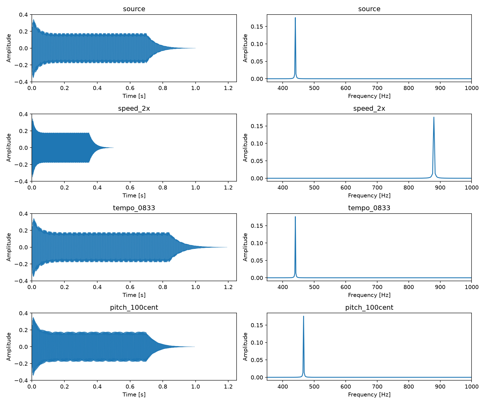
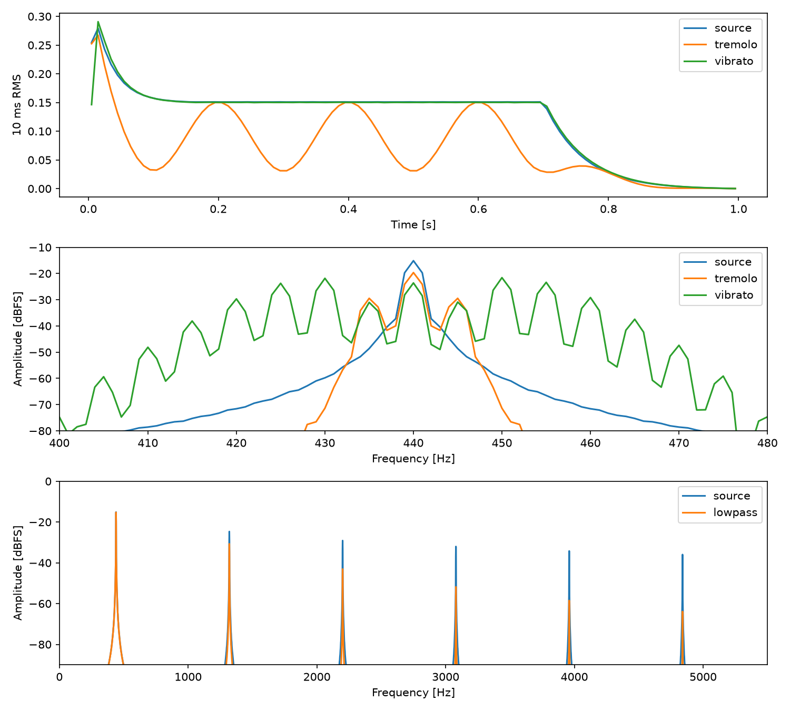
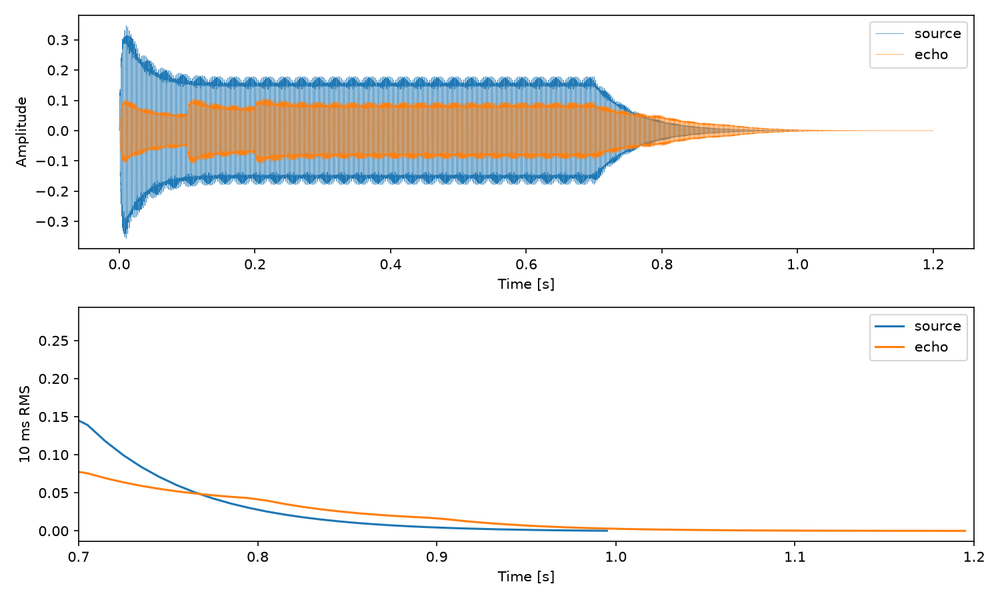

# シンセサイザーエフェクトの実装と解析

## 1. 目的

音長・音高・振幅・音色を変える処理を実行し、波形とスペクトルから各エフェクトの違いを調べた。特に、再生速度の変更とタイムストレッチの違い、および音長をほぼ保ったまま音高を変える方法を比較した。

音源生成にはCの `synth.c`、エフェクト処理にはFFmpeg 7.0.2を用いた。授業資料にあるSoXの処理例に対応する機能を、音声フィルタの組合せで実行したものであり、エフェクト内部のアルゴリズムを一から実装したものではない。

## 2. 入力音源と解析方法

入力はA4（440 Hz）、48 kHz、16 bit、モノラル、1秒の合成音である。奇数次高調波を49次まで重ね、係数の絶対値和を1にした。最高成分は21,560 Hzで、ナイキスト周波数24,000 Hzより低い。

包絡線はアタック0.01秒、ディケイ0.15秒、サステインレベル0.5、リリース0.3秒とした。区間境界で値が一致する指数関数形を用い、最後の標本でゼロになるようにした。合成式とソースは [音源生成レポート](report_generation.md) に示す。

解析方法は次の通りである。

- 音長：WAVの標本数を標本化周波数で割る。
- 最大振幅・RMS：16 bit PCMを32,768で割った値から計算する。
- 主ピーク：全標本にHann窓を掛けてFFTし、DCを除く最大振幅ビンの周波数を求める。補間は行わない。
- 図のスペクトル：DC・ナイキスト点以外を `2|FFT(xw)|/Σw` で振幅補正する。
- 音量の時間変化：480標本（10 ms）ごとのRMSを用いる。

周波数ビンの間隔は `fs/N` であり、1秒の音源では1 Hzとなる。主ピークは必ずしも基本周波数そのものではなく、変調音では側帯波が最大になる場合がある。

## 3. エフェクトの設定

| 処理 | FFmpegのフィルタ指定 |
|---|---|
| 速度2倍 | `asetrate=96000,aresample=48000` |
| テンポ0.833倍 | `atempo=0.833` |
| 音高+100 cent | `asetrate=50854,aresample=48000,atempo=0.943874313` |
| トレモロ | `tremolo=f=5:d=0.8` |
| ビブラート | `vibrato=f=5:d=0.5` |
| LPF | `lowpass=f=1000:p=2` |
| エコー | `aecho=0.6:0.5:100\|200:0.3\|0.15` |

半音の周波数比は `r=2^(1/12)≈1.059463` である。ピッチシフトでは、標本化周波数の解釈を約r倍にして音高を上げ、その後テンポを1/r倍にして音長を戻した。50,854 Hzは `48,000r` を整数に丸めた値である。

## 4. 音長と音高の比較

| 処理 | 標本数 | 音長 [s] | 主ピーク [Hz] | RMS | 最大絶対振幅 |
|---|---:|---:|---:|---:|---:|
| 入力 | 48,000 | 1.000000 | 440.000 | 0.136747 | 0.355896 |
| 速度2倍 | 24,000 | 0.500000 | 880.000 | 0.136211 | 0.351227 |
| テンポ0.833倍 | 57,265 | 1.193021 | 440.059 | 0.136684 | 0.353394 |
| 音高+100 cent | 47,779 | 0.995396 | 466.146 | 0.136872 | 0.351562 |
| トレモロ | 48,000 | 1.000000 | 440.000 | 0.092912 | 0.348572 |
| ビブラート | 48,000 | 1.000000 | 450.000 | 0.135747 | 0.340302 |
| LPF | 48,000 | 1.000000 | 440.000 | 0.123185 | 0.328857 |
| エコー | 57,600 | 1.200000 | 440.000 | 0.061802 | 0.108521 |



*図1：左列は全標本の時間波形、右列は主ピーク付近の振幅スペクトル。*

速度を2倍にすると、音長は半分、主ピークは2倍となった。同じ標本列を短い時間で再生すると、単位時間当たりの振動回数も増えるためである。

テンポ変更では、主ピークは約440 Hzのまま音長が伸びた。ただし、理論的な音長 `1/0.833≈1.200480` 秒に対して、出力は約7.46 ms短かった。短い有限長の音源では区間処理の端部の影響が現れ、指定倍率と出力標本数は厳密には一致していない。

半音上げた場合の理論周波数は約466.164 Hzであり、実測の466.146 HzはFFTのビン間隔の範囲で整合する。音長は入力より約4.60 ms短いが、約1秒を維持した。今回の処理は「音長を完全に不変にする」のではなく、「音長をほぼ保つ」処理として評価できる。

## 5. 変調とフィルタ



*図2：上段は10 msごとのRMS、中段は基本波付近のスペクトル、下段はLPF前後の比較。*

トレモロでは、元の包絡線に5 Hzの周期的な強弱が加わった。RMSは0.136747から0.092912に下がり、基本周波数の近傍には側帯波が現れた。振幅を時間的に変える操作は、周波数領域では成分を増やす操作でもある。

ビブラートでは、440 Hz付近のスペクトルが複数の成分に広がった。表の450 Hzは最も強い側帯波のビンであり、音全体を一定の450 Hzに移調したという意味ではない。周期的に周波数を揺らす処理と、固定量のピッチシフトを区別する必要がある。

LPFでは基本波はほぼ残り、高調波ほど大きく減衰した。同じ周波数ビンの入力・出力振幅から求めた比は次の通りである。

| 周波数 [Hz] | 入力に対する出力の振幅比 [dB] |
|---:|---:|
| 440 | −0.158 |
| 1,320 | −6.075 |
| 2,200 | −13.974 |

基本周波数をほぼ保ったまま高調波の比率を変えられるため、LPFを音色の制御に使える。今回の遮断周波数は1,000 Hzで一定であり、遮断周波数を時間的に動かすワウとは異なる。

## 6. エコー



*図3：上段は時間波形、下段は入力の終端付近のRMS。*

100 msと200 ms遅れた信号を加える設定により、出力は1.2秒となった。入力が終わる1.0秒以降にも信号が残り、1.0〜1.2秒のRMSは **0.000979** であった。

入出力ゲインを下げているため、エコー後のRMSは入力より小さい。残響の長さと音量の大小は別の指標である。また、この設定は2つの遅延信号を加えるエコーであり、多数の反射を持つ空間的なリバーブを十分に再現するものではない。

すべての出力で最大絶対振幅は1未満であり、保存されたPCMにフルスケール到達は見られなかった。この確認だけで、処理中の歪みや聴感上の問題まで否定することはできない。

## 7. 考察

音長と音高を同時に変える速度変更に対し、タイムストレッチを組み合わせれば、音高を保った伸縮や音長をほぼ保った移調が可能になった。ただし、今回のような1秒の音源では、数msの音長差が生じる。標本数の厳密な一致が必要な用途では、末尾の調整も別途必要である。

また、トレモロは振幅、ビブラートは周波数、LPFは高調波の比率を主に変える。RMSとスペクトルを併用することで、波形だけでは捉えにくい違いを整理できた。

今回は1種類の合成音に対する数値・画像評価である。音質の自然さは主ピークの一致だけでは判断できない。声や打楽器など異なる音源への適用と試聴は、別の評価として必要になる。

## 8. 再現・添付資料

```sh
make -C reports/pcm
python3 reports/reproduce.py
python3 reports/analyze_audio.py reports/assets/synth/*.wav
```

リポジトリのルートで実行する。処理の全コマンドは [commands.log](assets/commands.log)、測定値は [results.json](assets/results.json) に収録した。

音源：[入力](assets/synth/source.wav)、[速度変更](assets/synth/speed_2x.wav)、[テンポ変更](assets/synth/tempo_0833.wav)、[ピッチシフト](assets/synth/pitch_100cent.wav)、[トレモロ](assets/synth/tremolo.wav)、[ビブラート](assets/synth/vibrato.wav)、[LPF](assets/synth/lowpass.wav)、[エコー](assets/synth/echo.wav)。

図1〜3は実際の出力WAVから生成した解析グラフである。結果表示ページの [スクリーンショット](assets/synth/screenshot.png) も添付した。

出典：`../slide/Wk12-AnalogSynthesizer.pdf`、`../slide/Wk13-DigitalSynthesizer_2.pdf`（22ページの課題）、FFmpeg 7.0.2の組み込みヘルプ。
